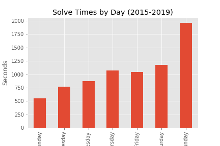
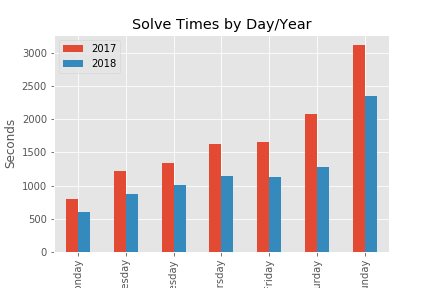
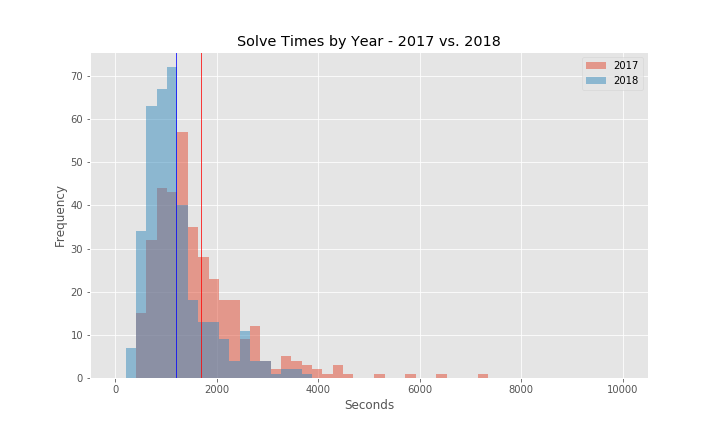
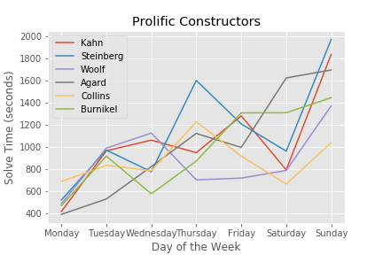
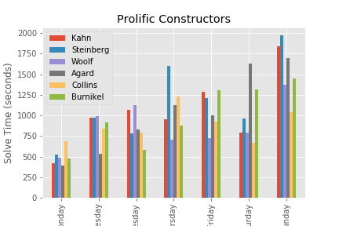

# Analysis New York Times Daily Crossword Puzzle

### Rationale

Generalized crossword statistics are easy to find, but it really difficult to get insights into your personal data. I do the New York Times crossword puzzle every day, and was interested in analyzing the several years of data I've accumulated. 

### Data 

I used a Selenium webscraper to login to my NYT puzzle account and scrape the following data for each daily puzzle

> Puzzle Date  
> Solve time (in seconds)  
> Day of the Week  
> Puzzle Author  
> Clues  

When I got my data I was so excited to start digging into it. Conventional wisdom is that Mondays are the easiest and crosswords get harder through the week, with Saturday being the hardest. Sundays are the largest puzzles and expect the longest solve times. 

### Analysis

I began by comparing the years 2017 and 2018 to see if there was improvement in solve times. 

> Null Hypothesis: There is no significant difference in average solve times between 2017 and 2018  

> Alternative Hypothesis: There is a significant difference in average solve times between 2017 and 2018  

### Results

I found a p-value: 1.9166e-12 and rejected the Null Hypothesis 

### Additional Insights

I wanted to look at prolific constructors who had hit for the cycle in the years for which I scraped 
Hit for the Cycle – a term borrowed from baseball, it means that a constructor has had at least one puzzle published for each day of the week.  Some interesting variation here in the lack of nice smooth upward trends, probably at least partially due to small sample size.  

### Future Steps 

In the future I would like to analyze data of clues further using NLP or searching for other clue attributes(like question marks, which indicate a play on words)

### Technology and Sources: 

Python, Jupyter, Selenium, Pandas, Numpy, Pyspark, matplotlib, SciPy, The New York Times 

